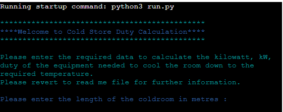

<h4>Project No.3 based on Code Institute template for deployment.</h4>


<h1 style="color : orange">Cold Room Calculation Software:</h1>

<span style="color: orange">https://cold-room-duty-calc.herokuapp.com/</span>

<br>

<div id="contents" style="font-weight: bold;">Contents:</div>

1. [Project Scope](#project_scope)

2. [User Experience](#user_stories)

3. [Project Design](#design)

4. [Structure](#structure)

5. [Testing](#testing)

6. [Validation](#validate)

7. [Bugs & Issues](#bugs)

7. [Deployment & Cloning](#deployment)

8. [Technologies Used](#tech)

9. [Project Credits](#credits)

<br>


## Project Scope: <div id="project_scope"></div> 
<p>The scope of this project is to create a simple command line driven program written in Python. I have written Python program to calculate the power requirement in kilowatts of the refrigeration equipment needed for cold and freezer storage rooms.</p>

<p>The program intakes a number of variables from the user to make this calculation. The following list main criteria required to work on the refrigeration duty.</p>

### Data Required:
<br>
<span style="color: orange">Length, width and height of the walls:</span> 
<p>The dimensions of the refrigerated room are required in order to calculate the volume of the room and surface area of the walls.</p>
<br>
<span style="color: orange">Thickness of the insulated panel from which the room is constructed:</span> 
<p>The user has numerical choice 1 to 4 to choice the type of insulated panel from which the room is constructed. Each choice has an associated U valve for its insulation properites. The lower the thicker the insulation, the lower the U value and hence the lower the amount of energy required to achieve the rooms target temperature.</p>
<br>
<span style="color: orange">Target temperature:</span> 
<p>The target temperature is the temperature we want the room to achieve and hold. The temperature range for chill room is +2 to +4°C, the target temperature for a freezer room would be -18 to -20°C. For particular applications or storage the target temperature can span between those two figures. The lower the target temperature is the higher the required power duty will be.</p>
<br>
<span style="color: orange">Floor insulation:</span> 
<p>The user is offered a yes / no choice, is there insulation under the floor? If the floor has insulation it recieves a higher U value.</p>
<br>
<span style="color: orange">Quantity of product:</span> 
<p>The quantity of product entering the refrigerated room in a 24 hour period is necessary as it forms a large part of the heat load. This is numerical figure and represents the quantity in kilograms </p>
<br>
<span style="color: orange">Temperature of the product:</span> 
<p>The entry temperature of the product will form the largest heat input value. The higher the temperature of the product the harder the refrigeration equipment will be required to work and ergo the higher power required.</p>
<br>
<span style="color: orange">Are there people in the room?:</span> 
<p>Another potentially significant source of heat is the presence of people working inside the room walls and generating additional heat which needs to be countered.</p>
<br>
<span style="color: orange">Number of door openings:</span> 
<p>The greater the number of door openings the larger the number of air changes. Refrigerated air leaving the room during door openings will be replaced with warm ambient air which will need to be chilled to the meet the target temperature, this will effect the required. A refrigerated room which experiences multiple loadings and unloadings during the day will need to work harder to replace the lost cold air. </p>
<br>


[Back to Contents](#contents) 
<br>
## UX / User Experience <div id="user_stories"></div> 
### User Stories
The target audience for this program would include the following people:
<ul>
<li>Refrigeration Engineers </li>
<li>Electrical Engineers </li>
<li>Cold Storage Suppliers </li>
<li>Transport Managers </li>
<li>Energy Management Engineers </li>
<li>Building and Facility Managers </li>
<li>Factories or Facilities with requirements for cold or frozen storage </li>
</ul>
<br>

#### Potential uses for this program:
<p> The program is designed to calculate the kilowatt load of the refrigeration plant, equipment, necessary to cool or freeze product(s) from a particular entry temperature to an ideal holding temperature. With this information a user can do the following </p>
<ol>
<li> Correctly size the necessary refrigeration equipment.</li>
<li> Design the most energy efficent room structure by running 'mock' room details to see how the construction of the room effects power requirements.</li>
<li> Help the electrical engineers size the required cabling and electrical installation requirements. </li>
<li> Calculate running costs and potential energy savings.</li>
</ol> 


[Back to Contents](#contents) 
<br>


## Project Design: <div id="design"></div>
<br>
<p>The project is a command line based program run running in a compact terminal window. As the program is designed to be functional and practical.
I have used colorama to add some color changes to the text.</p>
<p>In instances where the user has entered and invalid input the text which prompts them to enter a value of the correct type or inside the correct is red in color.</p>
<span style="color: orange">Image of intro screen:</span> 
<br>
<p align ="center">

</p>
<br>

## Program Structure: <div id="structure"></div>
<br>
<p>The program follows a step through process. Asking the user for data, verifying the data and then using the entered data in the appropriate calculation.</p>
<br>

#### Path of program:
<p> The program requests user input in this order. </p>
<ul>
<li>Length of the coldroom in metres.</li>
<li>Width of the coldroom in metres.</li>
<li>Height of the coldroom in metres.</li>
<li>The program then displays the entered data back to the user to confirm is its correct. If the user enters yes then the program continues, if not the user is asked to input the correct data.</li>
</ul>
<br>
<p align ="center">

</p>
<ul>
<li>If the user confirms the data entered is correct then the program calculates room volume and surface area of the the roof, walls and ceilings.</li>
</ul>
<br>
<p align ="center">
</p>
<br>
<ul>
<li>The user now inputs the temperature in celsius which is required in the room. </li>
<li>Users are presented with the four choices for the insulated panel of which the room is constructed. The program looks for an option between 1 and 4.</li>
<li>Once the panel size is selected the user then confirms if the room has an insulated floor with a yes or no selection.</li>
</ul>
<br>
<p align ="center">
</p>
<br>
<ul>
<li>Now the program looks for details of the product entering the room. The user enters the quantity of the product entering the room every 24 hours and the entry temperature of that product.</li>
<li>The user then must confirm if the room has people working in it, yes or no. If the user submits 'yes' then they will be asked to enter the number of people.</li> 
<li>Next, the program asks for an approximation for the number of door openings in a 24 hour period.</li>
</ul>
<br>
<p align ="center">
</p>
<br>
<ul>
<li>Once all details are entered the program returns an refrigeration duty loading in kilowatts based on the entered data. The program also creates a Google Sheet with the key data entered and the calculations made.</li>
</ul>
<p align ="center">
</p>
<br>
<span style="color: orange">Image of Google Sheet:</span> 
<br>


<br>

[Back to Contents](#contents) 
<br>

## Testing: <div id="testing"></div> 
<br>
<p>The program was tested for error handling by entering incorrect values at the user imput stage.</p>
<span style="color: orange">Inputting a letter, L, instead of a numerical value:</span> 
<br>


<br>
<span style="color: orange">Inputting a number, 8, instead of a yes or no:</span> 
<br>


<br>
<span style="color: orange">Inputting a letter, t, instead of numerical value:</span> 
<br>


<br>
<span style="color: orange">Inputting a letter, r, and a number, 8, instead of number in the range 1 to 4:</span> 
<br>


<br>
<span style="color: orange">Inputting a letter, S, and a symbol, =, instead of positive numerical value:</span> 
<br>


<br>
<span style="color: orange">Inputting letters, H and x, instead of a numerical value:</span> 
<br>


<br>
<span style="color: orange">Inputting letters, P and GGG, instead of a yes or no value. Entering letter E and the ? symbol instead of a whole positive number:</span> 
<br>


<br>
<span style="color: orange">Inputting letters, JKLM, and symbols, ..., instead of a positive numerical value:</span> 
<br>


<br>

[Back to Contents](#contents) 
<br>

## Validation: <div id="validate"></div> 
<br>
<p>The program was validated using PEP8 Online Python validator.</p>
<br>

http://pep8online.com
<br>
 
The program was free of errors. There was one warning message which is addressed in the [Bugs & Issues section](#bugs)
<br>
<p>In addition as part of the validation and testing process I carried out two tests, one based on a room designed as a chill room and the second based on a freezer room.</p>
<br>
<h3 style="color: orange">Chillroom Test:</h3>
<p>The criteria for the Chillroom Test is as follows:</p>


## Bugs & Issues: <div id="bugs"></div> 
<br>
<p>The initial validation process with PEP 8 produced numerous E501 errors. This error was generated by the length of multiple lines of code in the program.</p>
<p>These faults were addressed with the re-factoring of the code, however, this re-factoring generated multple W503 warnings - 'line break before binary operator'. The issue being that '+' in the 'Fore +' which is a formating option used as part of the colorama package to add color to certain text was seen as a 'binary operator'</p>
<p>Spliting a line of code with the '+' at the end or the start of a line would generate a warning.</p>
<br>
<span style="color: orange">Sample of initial code which generated the error:</span> 
<br>


<br>

<p>Based on this warning all relevant lines containing Fore code were altered and split at different points which eliminated multiple W503 and W504 warnings.

<p>There is 1no. W503 warning remaining. This relates to a line of code which had to be split due to its length generating an E501 error. As the line was split inline with Python best practises in terms of readability, with the '+' operator to the front of the line, presenting the relevant calculation code more clearly and having researched the warning I dont believe it to be an issue.</p>

https://www.python.org/dev/peps/pep-0008/#should-a-line-break-before-or-after-a-binary-operator
<br>

<span style="color: orange">Image of PEP8 results:</span> 
<br>

<br>


[Back to Contents](#contents) 
<br>

## Deployment & Cloning: <div id="deployment"></div>
<br>

### Deployment:
<br>

Deployment of this project is carried out with  Heroku, https://www.heroku.com . The deployment procedure is a follows.  
<ol>
<li>Log in to Heroku, creating a new account if you are not a current user.</li>
<li>Click on the 'New' button in the top right corner and from the drop-down menu select 'Create new app'.</li>
<li>Create an App name and select your Region from menu.</li>
<li>Click the 'Create App' button.</li>
<li>You will now have a menu for your new app. From here click on the Settings Tab and in the Config Vars. Click Reveal Config Vars.</li>
<br>
<p align ="center">
</p>
<br>

<li>You need to create Config Vars for the Google API Credentials. Enter 'CREDS' as the KEY and then copy the entire contents of the creds.json file from GITPOD in the VALUE section, click the Add button to finish.  </li>
<li>A second Config Vars will be required. In the KEY box enter 'PORT' and in the VALUE box enter 8000 and then click the Add button.</li>
<li>Scroll down to the Buildpacks section. Click Add buildpack. From the menu select Python and click Save Changes. </li>
<li>Click Add buildpack again and Node.js. The Buildpacks must added in this order. If not, you can click on the packs and drag them to the correct order as shown in the image.</li>
<br>
<p align ="center">
</p>
<br>
<li>Return to menu at the top of the page and click on Deploy. Select Github as the deployment method.</li>
<li>Confirm you want to connect to GitHub using your account credentials for Git. Once Heroku has access search for the relevant repository name and click the connect button.</li>
<li>At the bottom of the deploy page select the preferred deployment type. You can use Manual Deploy which will deploy based on the current state of the selected Git branch. You can also Enable Automatic Deploys for automatic deployment when you push updates to Github selected branch.</li>
<br>

[Back to Contents](#contents) 
<br>

### Cloning:

[Click here](https://help.github.com/en/github/creating-cloning-and-archiving-repositories/cloning-a-repository#cloning-a-repository-to-github-desktop) to retrieve pictures for some of the buttons and more detailed explanations of the above process.

1. Log in to GitHub and locate the [GitHub Repository] https://github.com/TNolan01/Cold_Store
2. Under the repository name, click "Code".
3. To clone the repository using HTTPS. Under "HTTPS" copy the link.
4. Go to your local terminal with git installed
5. Change the current working directory to the location where you want the cloned directory to be created/located.
6. Type `git clone` and then you paste in the URL you copied in Step 3.

  ```
  $ git clone https://github.com/TNolan01/Cold_Store
  ```

7. Press Enter. Your local clone will be created.
<br>

[Back to Contents](#contents) 
<br>